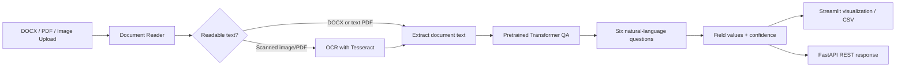

# System architecture

```mermaid
flowchart LR
    A[DOCX / PDF / Image Upload] --> B[Document Reader]
    B --> C{Readable text?}
    C -->|DOCX or text PDF| D[Extract document text]
    C -->|Scanned image/PDF| E[OCR with Tesseract]
    E --> D
    D --> F[Pretrained Transformer QA]
    F --> G[Six natural-language questions]
    G --> H[Field values + confidence]
    H --> I[Streamlit visualization / CSV]
    H --> J[FastAPI REST response]
```
